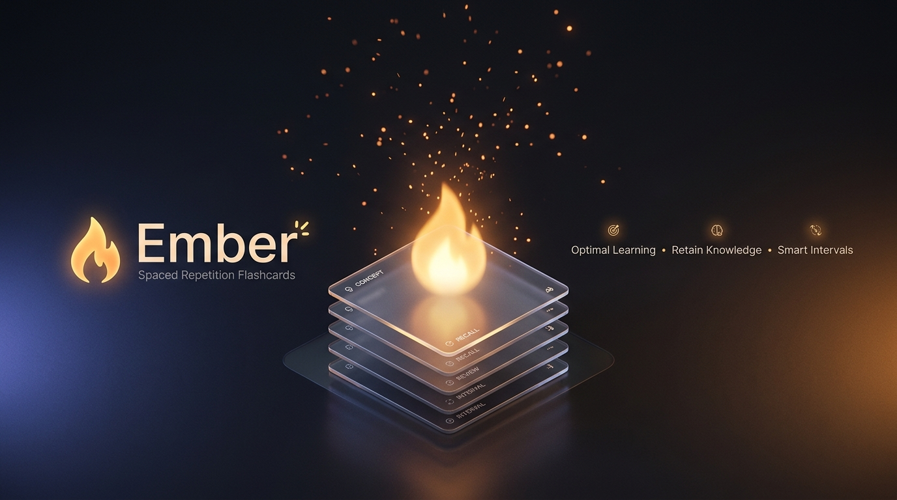

# Ember

**A thoughtful, beautiful spaced repetition flashcard app for Android.**  
*Remember anything for good — from cool dusk to glowing ember.*

[Download APK](https://github.com/he0xA1/ember-releases/releases/latest) • [Key Features](#-key-features) • [Card Types](#-flexible-card-types) • [Design Philosophy](#-visual-warmth--design) • [Getting Started](#-getting-started)

---

## 🌟 The Ember Idea

Cramming creates temporary familiarity, not durable memory. True retention happens when recall is actively challenged and timed just before you would otherwise forget.

**Ember** is built around one signature idea: **Memory Warmth**.  
A card's color directly reflects how solidly you know it:
- 🔵 **Cool Dusk** — New, untested, or recently lapsed cards.
- ⚪ **Neutral Slate** — Cards in early learning intervals.
- 🟡 **Warm Ember** — Deeply ingrained knowledge that has stood the test of time.

The design isn't just decorative — it is a visual rendering of your memory.

---

## ✨ Key Features

### 🧠 Modern Spaced Repetition Engine
- **Intelligent Scheduling**: Automatically calculates the exact optimal review interval for every single card so you spend time only where it's needed.
- **Honest 4-Button Grading**: Rate each card (*Again*, *Hard*, *Good*, *Easy*) to guide future review intervals.
- **Shuffle Answer Buttons**: Optional anti-muscle-memory mode that shuffles button positions so you deliberately evaluate each answer rather than tapping on autopilot.
- **Custom Daily Limits**: Configure how many new cards and review cards you want to tackle each day per deck.

### 🎴 The Tactile Review Loop
- **The Signature Ember Flip**: Fluid 3D card flip animation with color-responsive feedback indicating memory growth.
- **Gesture Controls**: Swipe to flip and grade with natural, one-handed thumb motions.
- **Procedural Sound Engine**: Subtle, organic audio cues that make card flips, ratings, and milestones feel physical and satisfying.
- **Study More Sessions**: Jump into custom extra practice sessions or cram specific tags anytime without affecting your main schedule.

### 📊 Meaningful Progress & Insights
- **Activity Heatmap**: A GitHub-style calendar matrix showing daily study intensity using the Dusk-to-Ember warmth scale.
- **True Retention Rate**: Clear metric displaying your actual recall accuracy over time.
- **Forecast Chart**: Visual breakdown of your upcoming review workload over the days ahead.
- **Streaks & Milestones**: Track your consecutive study days with built-in **Streak Freeze** protection to keep your momentum going through busy days.

### 🗣️ Built-in Speech & Audio (TTS)
- **Automatic Language Detection**: Smart language detection speaks cards aloud with authentic pronunciation in English, Spanish, French, German, Japanese, Chinese, Russian, and more.
- **Instant Pronunciation**: Tap the speaker button anytime or enable automatic speech playback during study sessions.

### 🔒 Privacy & Offline-First
- **Works 100% Offline**: All your decks and study history live securely on your device. Review cards on a flight, in the subway, or off the grid.
- **Backup & Restore**: Effortlessly export your entire collection and settings to a safe backup file and restore it with one tap on any device.
- **Optional Cloud Sync**: Sync seamlessly across multiple devices whenever you choose.
- **No Ads, No Tracking**: A clean, distraction-free study environment focused entirely on learning.

---

## 📝 Flexible Card Types

Ember supports a versatile variety of card formats designed for any subject:

| Card Type | What It's For | Example |
|---|---|---|
| **Basic** | Standard question and answer | Front: *"Capital of Australia"* → Back: *"Canberra"* |
| **Basic (Reversed)** | Two-way learning from a single note | Question ↔ Answer in both directions (ideal for vocabulary) |
| **Front / Back / Extra** | Context and mnemonics shown after the answer | Extra notes, etymology, and example sentences that won't spoil the prompt |
| **Cloze Deletion** | Fill-in-the-blank recall within sentences | `"The {{mitochondria}} is the powerhouse of the cell."` |
| **Type-In Answer** | Practice spelling and precise typing | Type your answer before flipping to verify spelling accuracy |
| **Image Cards** | Visual recognition and diagrams | Match diagrams, maps, artwork, or structures with descriptive prompts |

---

## 🎨 Visual Warmth & Design

Ember is crafted with an emphasis on calm, premium aesthetics and thoughtful typography:

- **Refined Color Palette**: 
  - **Paper & Charcoal**: Soft, high-contrast backgrounds tailored for day and night.
  - **Ember & Dusk**: Dynamic accents that communicate memory stability.
- **Typography with Personality**:
  - **Fraunces**: Elegant display serifs for titles and deck headers.
  - **Manrope**: Ultra-clean, modern geometric sans for study text and UI elements.
  - **IBM Plex Mono**: Tabular figures for statistics and streak counters.
- **Deck Themes**: Customize deck aesthetics with *Ember*, *Paper* (warm printed index card), *Terminal* (monospaced for code & tech), or *Dusk* (calm indigo).
- **Reduced Motion Support**: Fully respects system animation settings, seamlessly converting 3D flips into clean crossfades for users who prefer minimal motion.

---

## 📱 Getting Started

### 1. Download & Install
Download the latest APK directly from the [Releases Page](https://github.com/he0xA1/ember-releases/releases/latest) and install it on your Android device (Android 8.0 / API 26+).

### 2. Take the Guided Tour
On first launch, Ember walks you through a friendly 60-second interactive tour explaining how spaced repetition works and how to get the most out of your study sessions.

### 3. Add Starter Decks or Create Your Own
- **Instant Starter Decks**: Jump straight into learning with pre-built decks (German, Russian, French, Chinese) available in Settings.
- **Make Your Deck**: Tap **+** on the home screen to create a new deck and start writing your own cards in seconds!

---

## 🔔 Smart Reminders & Updates

- **Gentle Daily Nudges**: Set a daily reminder at your preferred time to maintain your study habit without hassle.
- **Automatic In-App Updates**: Receive gentle update notices right inside the app whenever new features or improvements are released.

---

**Ignite your memory with Ember.**

[Download Latest Release](https://github.com/he0xA1/ember-releases/releases/latest)

